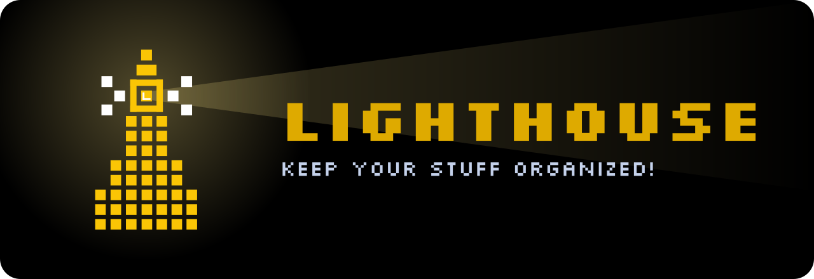
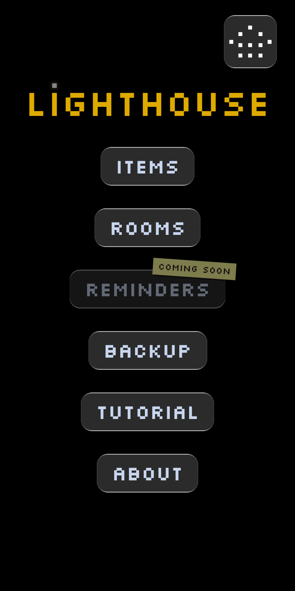
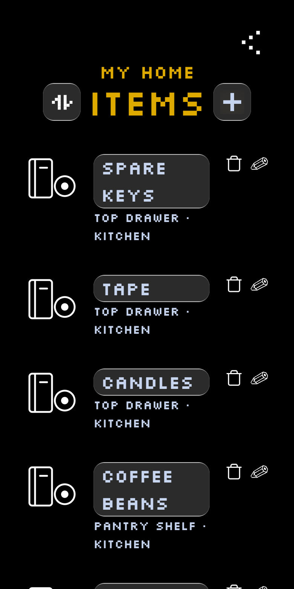
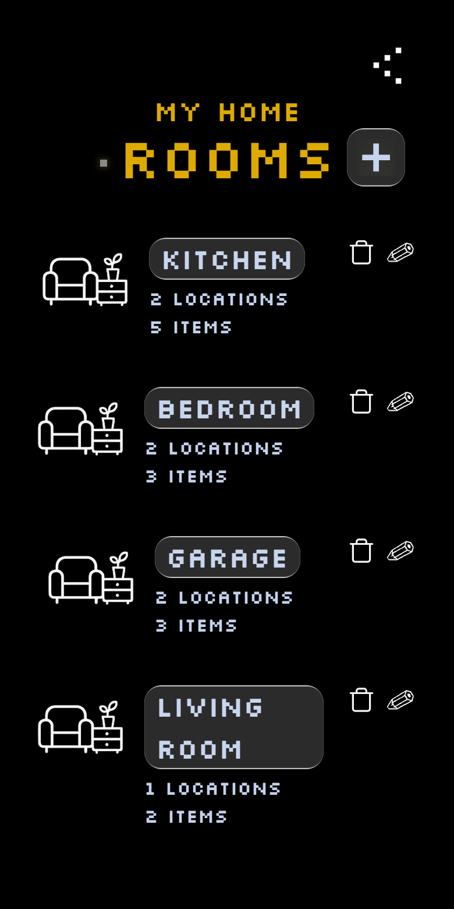
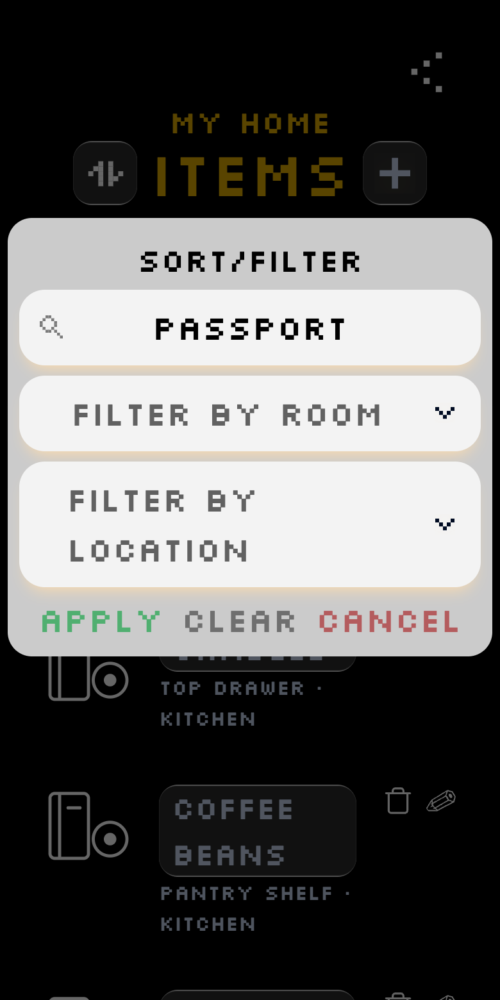
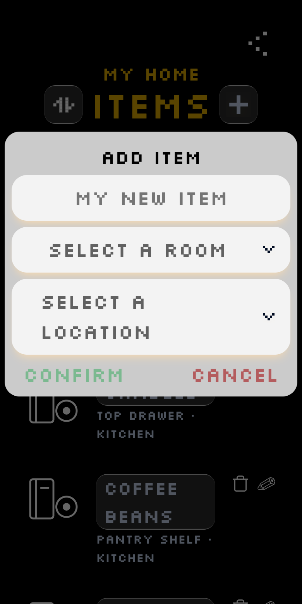
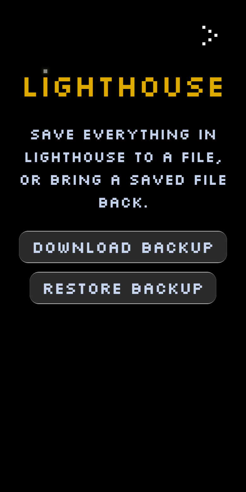

<p align="center">
  <a href="https://lighthouse.heyrema.com/">
    
  </a>
</p>

<p align="center">
  <a href="https://github.com/KabirHenry/lighthouse/actions/workflows/deploy.yml"></a>
  <a href="https://github.com/KabirHenry/lighthouse/tags"></a>
  <a href="https://lighthouse.heyrema.com/"></a>
  
  <a href="LICENCE"></a>
</p>

<p align="center">
  Lighthouse helps you keep your home items organized.<br />
  Whether it's on the top shelf or at the back of the closet, Lighthouse helps you find it.
</p>

<p align="center">
  <a href="https://lighthouse.heyrema.com/">
    
  </a>
</p>

<p align="center">
  <sub>Free, no sign-up. Runs in your browser, and you can add it to your home screen.</sub>
</p>

<br />

<table align="center">
  <tr>
    <td align="center"><br /><sub><b>Home</b></sub></td>
    <td align="center"><br /><sub><b>Every item, and where it is</b></sub></td>
    <td align="center"><br /><sub><b>Rooms at a glance</b></sub></td>
  </tr>
  <tr>
    <td align="center"><br /><sub><b>Search &amp; filter</b></sub></td>
    <td align="center"><br /><sub><b>Add in seconds</b></sub></td>
    <td align="center"><br /><sub><b>Backup &amp; restore</b></sub></td>
  </tr>
</table>

## ✨ Features

<table>
  <tr>
    <td width="50%" valign="top">
      <b>🗂️ Rooms, locations and items</b><br />
      Organize things the way your home is laid out: every item sits in a location (a drawer, a shelf, a box) inside a room. Each room shows how many locations and items it holds.
    </td>
    <td width="50%" valign="top">
      <b>🔍 Find anything fast</b><br />
      One list of everything you own, across every room, with where to find it. Search by name, or narrow the list down to certain rooms and locations.
    </td>
  </tr>
  <tr>
    <td width="50%" valign="top">
      <b>📷 Photos</b><br />
      Give any item, room or location a picture. Take one with your camera, pick one from your library, or drag and drop on desktop.
    </td>
    <td width="50%" valign="top">
      <b>🏘️ Multiple homes</b><br />
      Keep track of several places at once (a house, an apartment, a desk at work) and switch between them in a tap.
    </td>
  </tr>
  <tr>
    <td width="50%" valign="top">
      <b>⚡ Add in seconds</b><br />
      Add an item and create its room and location right there, if they don't exist yet.
    </td>
    <td width="50%" valign="top">
      <b>💾 Backup &amp; restore</b><br />
      Save everything, photos included, to a single <code>.lighthouse</code> file and bring it back on any device. Backups from older versions are upgraded automatically.
    </td>
  </tr>
  <tr>
    <td width="50%" valign="top">
      <b>🔒 Private by design</b><br />
      No accounts and no servers. Everything you add stays on your device.
    </td>
    <td width="50%" valign="top">
      <b>📱 Install it, use it offline</b><br />
      Add Lighthouse to your home screen and it works without a connection. It lets you know when an update is ready.
    </td>
  </tr>
  <tr>
    <td width="50%" valign="top">
      <b>🧭 Guided tour</b><br />
      An interactive walkthrough on sample data, so you can learn the ropes without touching your own things.
    </td>
    <td width="50%" valign="top">
      <b>⏰ Reminders</b><br />
      <i>Coming soon.</i>
    </td>
  </tr>
</table>

## 🛠️ Built with

<p>
  
  
  
  
</p>

Data is stored locally in IndexedDB (via [`idb`](https://github.com/jakearchibald/idb)), offline support comes from [`vite-plugin-pwa`](https://github.com/vite-pwa/vite-plugin-pwa), and the tour is built on [`react-joyride`](https://github.com/gilbarbara/react-joyride).

## 🚀 Run it locally

You'll need Node.js 22 (the version the deploy workflow uses).

```sh
git clone https://github.com/KabirHenry/lighthouse.git
cd lighthouse
npm install
npm run dev
```

| Command           | What it does                         |
| ----------------- | ------------------------------------ |
| `npm run dev`     | Start the dev server                 |
| `npm run build`   | Type-check and build for production  |
| `npm run preview` | Serve the production build locally   |
| `npm run lint`    | Lint the code                        |

Pushing a tag (for example, `npm version patch && git push --follow-tags`) builds the app and publishes it to GitHub Pages.

## 📄 Licence

Released under the [MIT Licence](LICENCE).

<br />

<p align="center">
  Made with ❤️ by <a href="https://www.linkedin.com/in/kabirhenry/">Kabir</a> and <a href="https://www.paramsid.com/">Param</a>.
</p>
